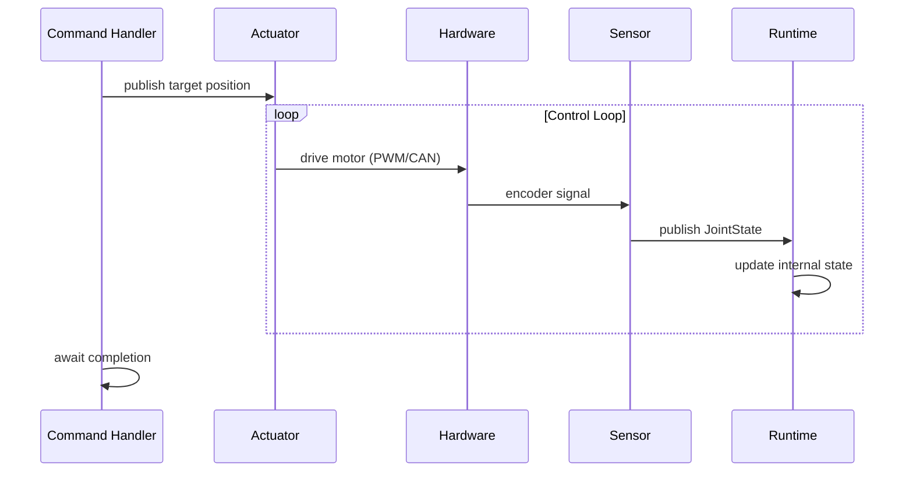

<!--
SPDX-FileCopyrightText: 2025 James Harton

SPDX-License-Identifier: Apache-2.0
-->

# Commands and State Machine

In this tutorial, you'll learn how to control your robot using commands and understand the robot state machine.

## Prerequisites

Complete [Starting and Stopping](02-starting-and-stopping.md). You should understand how to start a robot's supervision tree.

## The Robot State Machine

Every Beam Bots robot has a state machine that controls when commands can execute:

```
:disarmed ──arm──→ :idle
:idle ──execute──→ :executing
:executing ──complete──→ :idle
:idle ──disarm──→ :disarmed
```

- **:disarmed** - Robot is safe, actuators won't respond
- **:idle** - Robot is ready, waiting for commands
- **:executing** - A command is currently running

> **For Roboticists:** This is similar to the arming concept in flight controllers. A disarmed robot won't move even if commanded to.

> **For Elixirists:** Commands are like supervised async tasks with state machine guards. The robot only accepts certain commands based on its current state.

## Checking Robot State

Query the current state:

```elixir
iex> {:ok, _} = BB.Supervisor.start_link(MyRobot)
iex> BB.Robot.Runtime.state(MyRobot)
:disarmed
```

New robots always start in `:disarmed`.

## Built-in Arm and Disarm Commands

To use the standard arm/disarm commands, add them to your robot:

```elixir
defmodule MyRobot do
  use BB

  commands do
    command :arm do
      handler BB.Command.Arm
      allowed_states [:disarmed]
    end

    command :disarm do
      handler BB.Command.Disarm
      allowed_states [:idle]
    end
  end

  topology do
    # ... your robot topology
  end
end
```

The DSL generates convenience functions on your module:

```elixir
iex> {:ok, task} = MyRobot.arm()
iex> {:ok, :armed} = Task.await(task)

iex> BB.Robot.Runtime.state(MyRobot)
:idle
```

## Command Execution Model

Commands return a `Task.t()` that you can await:

```elixir
# Execute and wait for result
{:ok, task} = MyRobot.arm()
{:ok, result} = Task.await(task)

# Execute with timeout
{:ok, task} = MyRobot.move(shoulder: 0.5)
case Task.yield(task, 5000) || Task.shutdown(task) do
  {:ok, result} -> handle_result(result)
  nil -> handle_timeout()
end
```

Commands run in supervised tasks - if they crash, the robot returns to `:idle` (or the appropriate safe state).

## Defining Custom Commands

Add commands to your robot with the `commands` block:

```elixir
commands do
  command :arm do
    handler BB.Command.Arm
    allowed_states [:disarmed]
  end

  command :disarm do
    handler BB.Command.Disarm
    allowed_states [:idle]
  end

  command :move_joint do
    handler MyMoveJointCommand
    allowed_states [:idle]
  end
end
```

Each command specifies:
- **handler** - Module implementing `BB.Command` behaviour
- **allowed_states** - Robot states where this command can execute

## Implementing a Command Handler

Create a module implementing the `BB.Command` behaviour:

```elixir
defmodule MyMoveJointCommand do
  @behaviour BB.Command

  alias BB.Robot.State, as: RobotState

  @impl true
  def handle_command(goal, context) do
    # goal is a map of the arguments passed to the command
    # context provides access to robot state

    joint = Map.fetch!(goal, :joint)
    position = Map.fetch!(goal, :position)

    # Update joint position
    :ok = RobotState.set_joint_position(context.robot_state, joint, position)

    # Return the result
    new_position = RobotState.get_joint_position(context.robot_state, joint)
    {:ok, %{joint: joint, position: new_position}}
  end
end
```

The handler receives:
- **goal** - Map of arguments passed when executing the command
- **context** - Struct containing:
  - `robot_module` - The robot module
  - `robot` - The static robot struct
  - `robot_state` - The dynamic state (ETS-backed joint positions)
  - `execution_id` - Unique ID for this execution

## State vs Physical Movement

**Important:** Calling `RobotState.set_joint_position/3` only updates Beam Bots' internal representation of where joints are. It does **not** move physical hardware.

To actually move a robot, you need:

- **Actuators** - GenServer processes that subscribe to command messages and drive motors
- **Sensors** - GenServer processes that read encoders and publish `JointState` messages
- **Runtime** - subscribes to sensor messages and updates the internal state

Here's the typical flow:



A command handler might publish a target position:

```elixir
def handle_command(goal, context) do
  target = Map.fetch!(goal, :position)

  # Publish target for actuator to follow
  message = JointCommand.new!(:shoulder, target: target)
  PubSub.publish(context.robot_module, [:actuator, :shoulder], message)

  # Wait for actuator to reach target (simplified)
  await_position(context, :shoulder, target)

  {:ok, :moved}
end
```

An actuator subscribes to commands and drives hardware:

```elixir
defmodule ShoulderActuator do
  use GenServer

  alias BB.PubSub

  def start_link(opts) do
    GenServer.start_link(__MODULE__, opts)
  end

  @impl GenServer
  def init(opts) do
    robot = Keyword.fetch!(opts, :robot)

    # Subscribe to position commands for this joint
    PubSub.subscribe(robot, [:actuator, :shoulder])

    # Run control loop at 50Hz
    :timer.send_interval(20, :control_loop)

    {:ok, %{robot: robot, target: 0.0}}
  end

  @impl GenServer
  def handle_info({:bb, _path, %{payload: command}}, state) do
    # Received a new target position
    {:noreply, %{state | target: command.target}}
  end

  def handle_info(:control_loop, state) do
    # Drive motor toward target (PID, motion profile, etc.)
    drive_motor(state.target)
    {:noreply, state}
  end

  # Hardware interface (implement for your specific hardware)
  defp drive_motor(_target), do: :ok
end
```

A separate **sensor** reads the actual position and publishes it:

```elixir
defmodule ShoulderEncoder do
  use GenServer

  alias BB.PubSub
  alias BB.Message.Sensor.JointState

  def start_link(opts), do: GenServer.start_link(__MODULE__, opts)

  @impl GenServer
  def init(opts) do
    robot = Keyword.fetch!(opts, :robot)
    path = Keyword.fetch!(opts, :path)

    :timer.send_interval(20, :read_encoder)

    {:ok, %{robot: robot, path: path, last_position: 0.0}}
  end

  @impl GenServer
  def handle_info(:read_encoder, state) do
    position = read_encoder()
    velocity = (position - state.last_position) / 0.02

    {:ok, message} = JointState.new(:shoulder,
      name: [:shoulder],
      position: [position],
      velocity: [velocity],
      effort: []
    )
    PubSub.publish(state.robot, [:sensor | state.path], message)

    {:noreply, %{state | last_position: position}}
  end

  defp read_encoder, do: 0.0  # Your hardware code
end
```

The **Runtime** subscribes to sensor messages and updates the internal robot state automatically.

This separation mirrors real hardware:
- **Actuators** drive motors (output only)
- **Sensors** read encoders (input only)
- **Runtime** maintains the kinematic model from sensor feedback

> **For Roboticists:** This is the standard separation you'd expect. BB manages coordination; you provide the hardware drivers.

> **For Elixirists:** Actuators and sensors are independent GenServers that communicate via PubSub. The Runtime aggregates sensor data into a coherent robot state.

## Command Arguments

Define expected arguments with the `argument` entity:

```elixir
command :move_joint do
  handler MyMoveJointCommand
  allowed_states [:idle]

  argument :joint, :atom do
    required true
    doc "The joint to move"
  end

  argument :position, :float do
    required true
    doc "Target position in radians"
  end

  argument :velocity, :float do
    required false
    default 1.0
    doc "Movement velocity in rad/s"
  end
end
```

Execute with keyword arguments:

```elixir
{:ok, task} = MyRobot.move_joint(joint: :shoulder, position: 0.5)
{:ok, result} = Task.await(task)
```

## Return Values

Commands can return:

```elixir
# Success - robot returns to :idle
{:ok, result}

# Success with state transition
{:ok, result, next_state: :disarmed}

# Failure - robot returns to :idle
{:error, reason}
```

The `next_state` option is how `Arm` and `Disarm` control the state machine:

```elixir
# In BB.Command.Arm
def handle_command(_goal, _context) do
  {:ok, :armed}  # next_state defaults to :idle
end

# In BB.Command.Disarm
def handle_command(_goal, _context) do
  {:ok, :disarmed, next_state: :disarmed}
end
```

## State Validation

Commands only execute in their allowed states:

```elixir
iex> BB.Robot.Runtime.state(MyRobot)
:disarmed

iex> {:ok, task} = MyRobot.move_joint(joint: :shoulder, position: 0.5)
iex> Task.await(task)
{:error, %BB.Robot.Runtime.StateError{
  current_state: :disarmed,
  allowed_states: [:idle]
}}
```

## A Complete Example

Here's a robot with arm, disarm, and a custom move command:

```elixir
defmodule SimpleArm do
  use BB

  defmodule MoveCommand do
    @behaviour BB.Command
    alias BB.PubSub

    @impl true
    def handle_command(goal, context) do
      # Publish target positions to actuators
      for {joint, position} <- Map.take(goal, [:shoulder, :elbow]) do
        PubSub.publish(context.robot_module, [:actuator, joint], %{target: position})
      end

      # In a real implementation, you'd wait for sensors to confirm
      # the joints reached their targets
      {:ok, :move_commanded}
    end
  end

  commands do
    command :arm do
      handler BB.Command.Arm
      allowed_states [:disarmed]
    end

    command :disarm do
      handler BB.Command.Disarm
      allowed_states [:idle]
    end

    command :move do
      handler MoveCommand
      allowed_states [:idle]
    end
  end

  topology do
    link :base do
      joint :shoulder do
        type :revolute

        axis do
        end

        limit do
          effort(~u(50 newton_meter))
          velocity(~u(2 radian_per_second))
        end

        link :upper_arm do
          joint :elbow do
            type :revolute

            axis do
            end

            limit do
              effort(~u(30 newton_meter))
              velocity(~u(3 radian_per_second))
            end

            link :forearm do
            end
          end
        end
      end
    end
  end
end
```

Use it:

```elixir
iex> {:ok, _} = BB.Supervisor.start_link(SimpleArm)

# Arm the robot
iex> {:ok, task} = SimpleArm.arm()
iex> {:ok, :armed} = Task.await(task)

# Move joints (publishes targets to actuators)
iex> {:ok, task} = SimpleArm.move(shoulder: 0.5, elbow: 1.0)
iex> {:ok, :move_commanded} = Task.await(task)

# Disarm
iex> {:ok, task} = SimpleArm.disarm()
iex> {:ok, :disarmed} = Task.await(task)
```

## Subscribing to State Transitions

Monitor state machine changes via PubSub:

```elixir
BB.PubSub.subscribe(MyRobot, [:state_machine])

{:ok, task} = MyRobot.arm()
Task.await(task)

# Receive transition messages
receive do
  {:bb, [:state_machine], %BB.Message{payload: transition}} ->
    IO.puts("#{transition.from} → #{transition.to}")
end
```

## Command Preemption

By default, commands can only run in `:idle` state - you can't start a new command while one is executing. But sometimes you want commands that can interrupt a running command.

Add `:executing` to `allowed_states` to enable preemption:

```elixir
commands do
  command :move_to do
    handler MoveToCommand
    allowed_states [:idle, :executing]  # Can preempt other commands
  end

  command :emergency_stop do
    handler EmergencyStopCommand
    allowed_states [:idle, :executing]  # Can always run
  end
end
```

When a command executes in `:executing` state:
1. The currently running command's task is cancelled
2. The new command starts immediately
3. The preempted command receives `{:error, :preempted}`

This is useful for:
- **Motion commands** - send a new target without waiting for the previous move to complete
- **Emergency stop** - immediately halt regardless of what's running
- **Trajectory updates** - smoothly blend into a new path

Example with preemptable motion:

```elixir
# Start moving to position A
{:ok, task_a} = MyRobot.move_to(position: 1.0)

# Before it completes, redirect to position B
{:ok, task_b} = MyRobot.move_to(position: 2.0)

# task_a returns {:error, :preempted}
# task_b continues to completion
```

> **Caution:** Only allow preemption for commands where interruption is safe. A calibration routine or homing sequence probably shouldn't be preemptable.

## Cancelling Commands

Cancel a running command explicitly:

```elixir
{:ok, task} = MyRobot.long_running_command()

# Later, if needed
BB.Robot.Runtime.cancel(MyRobot)

# The task will return {:error, :cancelled}
```

## What's Next?

You now understand the command system and robot state machine. In the final tutorial, we'll:

- Export your robot to URDF format
- Visualise it in external tools
- Understand URDF limitations

Continue to [Exporting to URDF](06-urdf-export.md).
