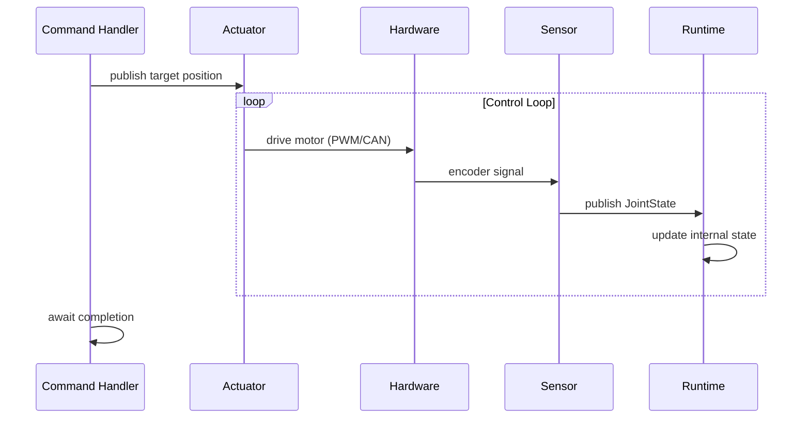

<!--
SPDX-FileCopyrightText: 2025 James Harton

SPDX-License-Identifier: Apache-2.0
-->

# Commands and State Machine

In this tutorial, you'll learn how to control your robot using commands and understand the robot state machine.

## Prerequisites

Complete [Starting and Stopping](02-starting-and-stopping.md). You should understand how to start a robot's supervision tree.

## The Robot State Machine

Every Beam Bots robot has a state machine that controls when commands can execute:

```
:disarmed ──arm──→ :idle
:idle ──execute──→ :executing
:executing ──complete──→ :idle
:idle ──disarm──→ :disarmed
```

- **:disarmed** - Robot is safe, actuators won't respond
- **:idle** - Robot is ready, waiting for commands
- **:executing** - A command is currently running

> **For Roboticists:** This is similar to the arming concept in flight controllers. A disarmed robot won't move even if commanded to.

> **For Elixirists:** Commands are short-lived GenServers with state machine guards. The robot only accepts certain commands based on its current state.

## Checking Robot State

Query the current state:

```elixir
iex> {:ok, _} = BB.Supervisor.start_link(MyRobot)
iex> BB.Robot.Runtime.state(MyRobot)
:disarmed
```

New robots always start in `:disarmed`.

## Built-in Arm and Disarm Commands

To use the standard arm/disarm commands, add them to your robot:

```elixir
defmodule MyRobot do
  use BB

  commands do
    command :arm do
      handler BB.Command.Arm
      allowed_states [:disarmed]
    end

    command :disarm do
      handler BB.Command.Disarm
      allowed_states [:idle]
    end
  end

  topology do
    # ... your robot topology
  end
end
```

The DSL generates convenience functions on your module:

```elixir
iex> {:ok, cmd} = MyRobot.arm()
iex> {:ok, :armed, _opts} = BB.Command.await(cmd)

iex> BB.Robot.Runtime.state(MyRobot)
:idle
```

## Command Execution Model

Commands are short-lived GenServers. When you execute a command:

1. The Runtime spawns a supervised GenServer for the command
2. You receive the command's pid
3. Use `BB.Command.await/2` or `BB.Command.yield/2` to get the result

```elixir
# Execute and wait for result
{:ok, cmd} = MyRobot.arm()
{:ok, result, _opts} = BB.Command.await(cmd)

# Execute with timeout
{:ok, cmd} = MyRobot.move(shoulder: 0.5)
case BB.Command.yield(cmd, 5000) do
  {:ok, result} -> handle_result(result)
  {:error, reason} -> handle_error(reason)
  nil -> handle_still_running()
end
```

Commands run in supervised GenServers - if they crash, the robot returns to `:idle` (or the appropriate safe state) and awaiting callers receive an error.

## Defining Custom Commands

Add commands to your robot with the `commands` block:

```elixir
commands do
  command :arm do
    handler BB.Command.Arm
    allowed_states [:disarmed]
  end

  command :disarm do
    handler BB.Command.Disarm
    allowed_states [:idle]
  end

  command :move_joint do
    handler MyMoveJointCommand
    allowed_states [:idle]
  end
end
```

Each command specifies:
- **handler** - Module using `BB.Command`
- **allowed_states** - Robot states where this command can execute

## Implementing a Command Handler

Create a module using `BB.Command`:

```elixir
defmodule MyMoveJointCommand do
  use BB.Command

  alias BB.Robot.State, as: RobotState

  @impl BB.Command
  def handle_command(goal, context, state) do
    # goal is a map of the arguments passed to the command
    # context provides access to robot state
    # state is the command's internal state (includes :result key)

    joint = Map.fetch!(goal, :joint)
    position = Map.fetch!(goal, :position)

    # Update joint position
    :ok = RobotState.set_joint_position(context.robot_state, joint, position)

    # Get the new position and store result
    new_position = RobotState.get_joint_position(context.robot_state, joint)
    {:stop, :normal, %{state | result: {:ok, %{joint: joint, position: new_position}}}}
  end

  @impl BB.Command
  def result(%{result: result}), do: result
end
```

### Required Callbacks

**`handle_command/3`** - The main entry point:
- **goal** - Map of arguments passed when executing the command
- **context** - Struct containing:
  - `robot_module` - The robot module
  - `robot` - The static robot struct
  - `robot_state` - The dynamic state (ETS-backed joint positions)
  - `execution_id` - Unique ID for this execution
- **state** - The command's internal state map (includes `:result` and `:next_state` keys)

Returns GenServer-style tuples:
- `{:noreply, state}` - Continue running (waiting for messages)
- `{:noreply, state, timeout | :hibernate | {:continue, term}}` - Continue with action
- `{:stop, reason, state}` - Complete the command

**`result/1`** - Extract the result when command stops:
- Called in `terminate/2` to get the result for awaiting callers
- Returns `{:ok, result}`, `{:ok, result, opts}`, or `{:error, reason}`

### Optional Callbacks

**`init/1`** - Initialise command state (default returns `{:ok, Map.new(opts)}`)

**`handle_safety_state_change/2`** - Handle safety transitions:
```elixir
@impl BB.Command
def handle_safety_state_change(:disarming, state) do
  # Robot is being disarmed - stop gracefully
  {:stop, :disarmed, state}
end

def handle_safety_state_change(_new_state, state) do
  # Continue execution (use with care!)
  {:continue, state}
end
```

The default implementation stops with `:disarmed` on any safety state change.

**`handle_info/2`**, **`handle_call/3`**, **`handle_cast/2`** - Standard GenServer callbacks for receiving messages during execution.

## Async Commands

Commands that wait for external events (sensors, timers) can use the full GenServer lifecycle:

```elixir
defmodule WaitForPositionCommand do
  use BB.Command

  alias BB.PubSub

  @impl BB.Command
  def handle_command(goal, context, state) do
    target = Map.fetch!(goal, :target_position)
    joint = Map.fetch!(goal, :joint)

    # Subscribe to sensor updates
    PubSub.subscribe(context.robot_module, [:sensor, joint])

    # Store target in state and wait
    {:noreply, %{state | target: target, joint: joint}}
  end

  @impl BB.Command
  def handle_info({:bb, [:sensor, _joint], %{payload: joint_state}}, state) do
    current = hd(joint_state.positions)

    if abs(current - state.target) < 0.01 do
      # Reached target
      {:stop, :normal, %{state | result: {:ok, %{final_position: current}}}}
    else
      {:noreply, state}
    end
  end

  def handle_info(_msg, state), do: {:noreply, state}

  @impl BB.Command
  def result(%{result: result}), do: result
end
```

## State vs Physical Movement

**Important:** Calling `RobotState.set_joint_position/3` only updates Beam Bots' internal representation of where joints are. It does **not** move physical hardware.

To actually move a robot, you need:

- **Actuators** - GenServer processes that subscribe to command messages and drive motors
- **Sensors** - GenServer processes that read encoders and publish `JointState` messages
- **Runtime** - subscribes to sensor messages and updates the internal state

Here's the typical flow:



A command handler might publish a target position:

```elixir
@impl BB.Command
def handle_command(goal, context, state) do
  target = Map.fetch!(goal, :position)

  # Publish target for actuator to follow
  message = JointCommand.new!(:shoulder, target: target)
  PubSub.publish(context.robot_module, [:actuator, :shoulder], message)

  # Subscribe to sensor feedback
  PubSub.subscribe(context.robot_module, [:sensor, :shoulder])

  {:noreply, %{state | target: target}}
end

@impl BB.Command
def handle_info({:bb, [:sensor, :shoulder], %{payload: joint_state}}, state) do
  if close_enough?(joint_state, state.target) do
    {:stop, :normal, %{state | result: {:ok, :moved}}}
  else
    {:noreply, state}
  end
end
```

## Command Arguments

Define expected arguments with the `argument` entity:

```elixir
command :move_joint do
  handler MyMoveJointCommand
  allowed_states [:idle]

  argument :joint, :atom do
    required true
    doc "The joint to move"
  end

  argument :position, :float do
    required true
    doc "Target position in radians"
  end

  argument :velocity, :float do
    required false
    default 1.0
    doc "Movement velocity in rad/s"
  end
end
```

Execute with keyword arguments:

```elixir
{:ok, cmd} = MyRobot.move_joint(joint: :shoulder, position: 0.5)
{:ok, result} = BB.Command.await(cmd)
```

## Return Values

The `result/1` callback returns:

```elixir
# Success - robot returns to :idle
{:ok, result}

# Success with state transition
{:ok, result, next_state: :disarmed}

# Failure - robot returns to :idle
{:error, reason}
```

The `next_state` option is how `Arm` and `Disarm` control the state machine:

```elixir
# In BB.Command.Arm
@impl BB.Command
def result(%{result: {:ok, value}, next_state: next_state}) do
  {:ok, value, next_state: next_state}
end

# In BB.Command.Disarm - transitions to :disarmed
def result(%{result: {:ok, value}, next_state: next_state}) do
  {:ok, value, next_state: next_state}
end
```

## Error Handling

Commands should return structured errors from `BB.Error`:

```elixir
alias BB.Error.State.NotAllowed

@impl BB.Command
def handle_command(goal, context, state) do
  case validate_goal(goal) do
    :ok ->
      # proceed
      {:noreply, state}

    {:error, reason} ->
      {:stop, :normal, %{state | result: {:error, reason}}}
  end
end
```

When a command cannot start (wrong state), `execute/3` returns the error directly:

```elixir
iex> BB.Robot.Runtime.state(MyRobot)
:disarmed

iex> MyRobot.move_joint(joint: :shoulder, position: 0.5)
{:error, %BB.Error.State.NotAllowed{
  current_state: :disarmed,
  allowed_states: [:idle]
}}
```

## State Validation

Commands only execute in their allowed states:

```elixir
iex> BB.Robot.Runtime.state(MyRobot)
:disarmed

iex> MyRobot.move_joint(joint: :shoulder, position: 0.5)
{:error, %BB.Error.State.NotAllowed{
  current_state: :disarmed,
  allowed_states: [:idle]
}}
```

## A Complete Example

Here's a robot with arm, disarm, and a custom move command:

```elixir
defmodule SimpleArm do
  use BB

  defmodule MoveCommand do
    use BB.Command

    alias BB.Robot.State, as: RobotState

    @impl BB.Command
    def handle_command(goal, context, state) do
      positions =
        goal
        |> Enum.into(%{})
        |> Map.take([:shoulder, :elbow])

      :ok = RobotState.set_positions(context.robot_state, positions)

      new_positions = RobotState.get_all_positions(context.robot_state)
      {:stop, :normal, %{state | result: {:ok, new_positions}}}
    end

    @impl BB.Command
    def result(%{result: result}), do: result
  end

  commands do
    command :arm do
      handler BB.Command.Arm
      allowed_states [:disarmed]
    end

    command :disarm do
      handler BB.Command.Disarm
      allowed_states [:idle]
    end

    command :move do
      handler MoveCommand
      allowed_states [:idle]
    end
  end

  topology do
    link :base do
      joint :shoulder do
        type :revolute

        axis do
        end

        limit do
          effort(~u(50 newton_meter))
          velocity(~u(2 radian_per_second))
        end

        link :upper_arm do
          joint :elbow do
            type :revolute

            axis do
            end

            limit do
              effort(~u(30 newton_meter))
              velocity(~u(3 radian_per_second))
            end

            link :forearm do
            end
          end
        end
      end
    end
  end
end
```

Use it:

```elixir
iex> {:ok, _} = BB.Supervisor.start_link(SimpleArm)

# Arm the robot
iex> {:ok, cmd} = SimpleArm.arm()
iex> {:ok, :armed, _} = BB.Command.await(cmd)

# Move joints
iex> {:ok, cmd} = SimpleArm.move(shoulder: 0.5, elbow: 1.0)
iex> {:ok, positions} = BB.Command.await(cmd)

# Disarm
iex> {:ok, cmd} = SimpleArm.disarm()
iex> {:ok, :disarmed, _} = BB.Command.await(cmd)
```

## Subscribing to State Transitions

Monitor state machine changes via PubSub:

```elixir
BB.PubSub.subscribe(MyRobot, [:state_machine])

{:ok, cmd} = MyRobot.arm()
BB.Command.await(cmd)

# Receive transition messages
receive do
  {:bb, [:state_machine], %BB.Message{payload: transition}} ->
    IO.puts("#{transition.from} → #{transition.to}")
end
```

## Command Preemption

By default, commands can only run in `:idle` state - you can't start a new command while one is executing. But sometimes you want commands that can interrupt a running command.

Add `:executing` to `allowed_states` to enable preemption:

```elixir
commands do
  command :move_to do
    handler MoveToCommand
    allowed_states [:idle, :executing]  # Can preempt other commands
  end

  command :emergency_stop do
    handler EmergencyStopCommand
    allowed_states [:idle, :executing]  # Can always run
  end
end
```

When a command executes in `:executing` state:
1. The currently running command is cancelled
2. The new command starts immediately
3. The preempted command's `result/1` is called and awaiting callers receive the result

This is useful for:
- **Motion commands** - send a new target without waiting for the previous move to complete
- **Emergency stop** - immediately halt regardless of what's running
- **Trajectory updates** - smoothly blend into a new path

Example with preemptable motion:

```elixir
# Start moving to position A
{:ok, cmd_a} = MyRobot.move_to(position: 1.0)

# Before it completes, redirect to position B
{:ok, cmd_b} = MyRobot.move_to(position: 2.0)

# cmd_a returns {:error, :cancelled} (if result/1 handles nil result)
# cmd_b continues to completion
```

> **Caution:** Only allow preemption for commands where interruption is safe. A calibration routine or homing sequence probably shouldn't be preemptable.

## Cancelling Commands

Cancel a running command explicitly:

```elixir
{:ok, cmd} = MyRobot.long_running_command()

# Later, if needed
BB.Robot.Runtime.cancel(MyRobot)

# The command's result/1 is called and awaiting callers receive the result
```

## What's Next?

You now understand the command system and robot state machine. In the next tutorial, we'll:

- Export your robot to URDF format
- Visualise it in external tools
- Understand URDF limitations

Continue to [Exporting to URDF](06-urdf-export.md).
